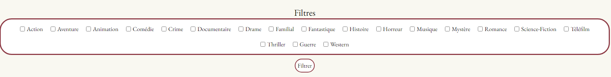
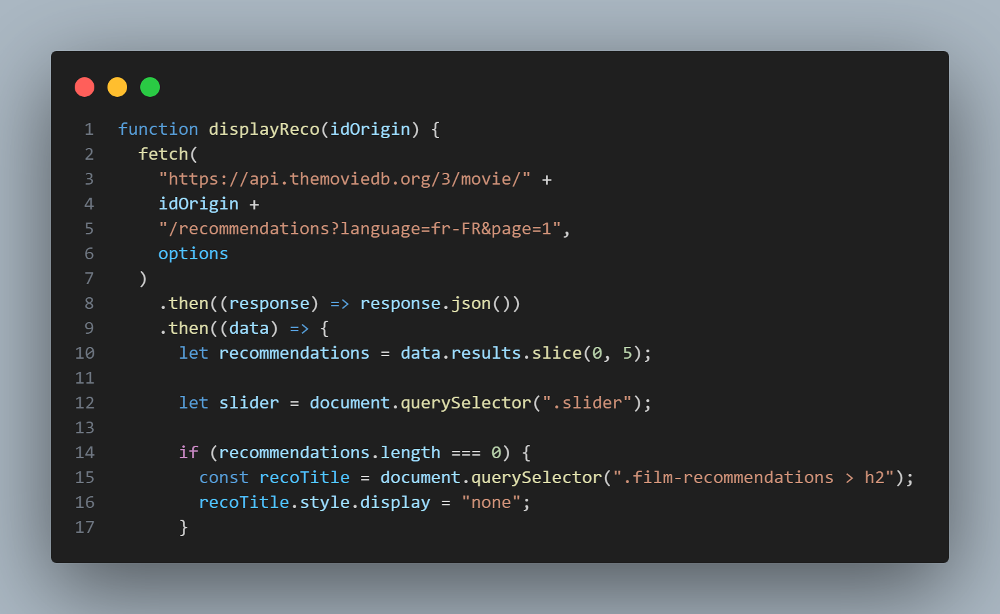

# Brief 3 - Création d'une page web dynamique pour GCR Cinéma - Marie / Olivier

## Besoin

GCR Cinéma a besoin d'une nouvelle page web pour afficher les films à l'affiche de manière plus dynamique et interactive. Cette page web sera utilisée par les clients pour découvrir les films, lire les descriptions et choisir les films qu'ils souhaitent voir.

## Spécifications de la page web

- La page web doit afficher les films à l'affiche sous forme de cartes interactives et triés de la date de sortie du plus proche a la plus élognée.
- Chaque carte doit afficher le titre du film, l'affiche, la date de sortie, la durée et le genre.
- Au clic sur une carte, une nouvelle page doit s'ouvrir avec la description détaillée du film.
- La page web doit utiliser l'API TheMovieDB pour récupérer les informations des films.
- La page web doit être responsive et accessible sur tous les appareils.

## Fonctionnalités

- Visualiser les prochaines sorties avec une carte contenant un visuel de celui-ci.
  
- Possibilité de filtrer les films.
  
- Lire le descriptif d'un film.
  
- Voir les films associés sur la page d'un descriptif de film.
  

## Critères de performance

- La page web doit être fluide et réactive sur tous les appareils.
- Le code doit être propre, bien commenté et documenté.
- L'utilisation de l'API CGR Cinéma doit être conforme à la documentation officielle.
- Utilisation de outils GitHub pour la gestion de vos tâches. Taches - Issues - Branche - Pull request

## Points techniques

### Page Liste des films

- Obtention et Affichage de la liste des films
  

- Affichage d'une carte film

- Obtention et Affichage genre

- Filtre des films
  

### Page Détails d'un film

- Obtention et affichage details sur un film
  

- Obtention et affichage recommandation de film
  
